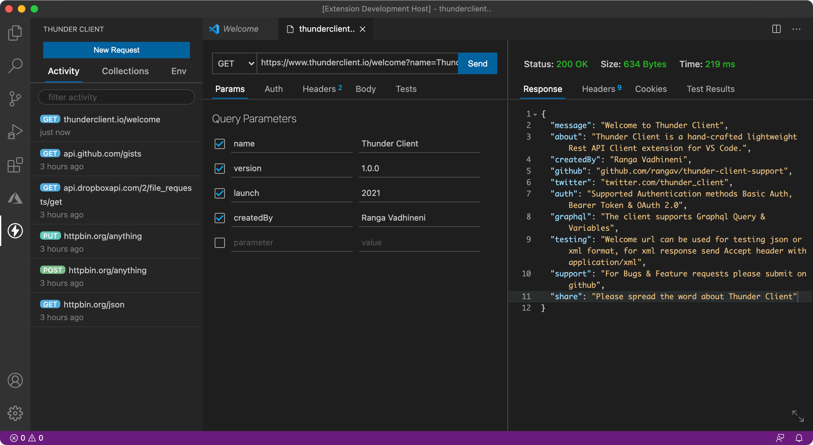

# Thunder Client
Thunder Client is a GUI based Rest API Client Extension for Visual Studio Code, hand-crafted by [Ranga Vadhineni](https://twitter.com/ranga_vadhineni) with simple and clean design. The source code is not open source. You can report any Bugs Or Feature requests here.

* Website - [www.thunderclient.io](https://www.thunderclient.io)
* Follow on Twitter for updates - [twitter.com/thunder_client](https://twitter.com/thunder_client)
* You can reach me on [LinkedIn](https://www.linkedin.com/in/rangav/) or [Twitter](https://twitter.com/ranga_vadhineni).

## Usage
Install the Extension, Click Thunder Client icon on the Action Bar.


## Story behind Thunder Client
I work for my other project [localmint.com](https://www.localmint.com/), where I need to update the location data regularly, which involves dealing with lot of Crawlers & APIs. I was using Postman to test APIs from last few years, But recently for each update the Postman client is becoming slow and confusing UI, So I started looking for other clients, which I found requires multiple clicks to make a simple api request and complex UI. Then I searched the VS Code extension gallery and found REST Client extension which is popular but not a GUI based client. So I finally decided to create a GUI based extension which is simple, easy to use and one click access to most functionality.

## Tech
* Thunder Client is built with Javascript, Flexbox, Typescript, Ace Editor, Got, Nedb. No javascript or bootstrap frameworks used.

## Features
* Send http/https API request using any of the methods GET, POST, PUT, DELETE, PATCH, HEAD and OPTIONS.
* The Response data supports **syntax hightlighting using ACE Editor** which can handle large responses easily, you can also view response in **Full Screen**
* **History, Collections and Environment** Tabs in the Action Bar View for quick access.
* **Authentication:** Basic Auth, Bearer Token and OAuth 2.0 are supported.
* **Headers:** You can send http headers to test api, with **auto-complete** support.
* **Post Body:** Send post body as Text, Json, Xml, Form Data and Form-Url-Encoded.
* **Graphql:** Send Graphql Query & Variables has syntax highlighting support.
* **Environment Variables:** Syntax highlighting support for environment variables just use `{{variable}}` syntax in most fields
* **Scriptless Testing:** Test APIs with GUI based functionality, no scripting knowledge needed.
* **Themes:** The extension also supports VS Code themes.

## Import/Export
* You can import or export Thunder Client collections data, useful to share with team mates.
* Currently you can import collection or Environment file from Postman also. ( other file formats support soon.. ).

## Scriptless Testing
I noticed we need to write lot of biolerplate code in Postman and other clients to do basic testing using scripting like status code equal 200. So I implemented GUI based tests, where you select couple of dropdowns to do most standard tests easily without scripting knowledge.


### Test Examples

**Postman Response Code**
```
pm.test("Status code is 200", function () {
    pm.response.to.have.status(200);
});
```

***Thunder Client Response Code***

